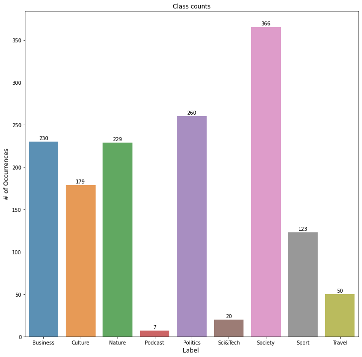
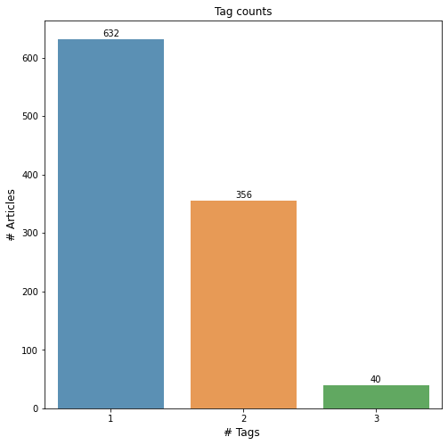

This project was done with the main goal of practicing and applying my knowledge on how to build an end-to-end machien learning project. This goes from scraping data, feature enginerring up to training and evaluating the model and deploying it in a local server using Flask and an EC2 instance. The main motivation was the practice of model deployment and scraping data in a usable format to be further used in a model. Better performance would probably be feasible by using a more complex model or more data but, nevertheless, the model seems to be aceptably performant. 

## Data 

The data in use was scraped from multiple websites with icelandic news. From the websites the article itself, its title and the topics of the article were scraped. Each article may have one or more topic and therefore this will be a multilabelling exercise. 

The label distribution found in the data follows the following distribution. 

Below one can observe the distribution of the number of labels per article. 

## Feature Engineering

In order to get the data in a format the model can be trained on the articles need to be processed. First the TF-IDF was applied in order to vectorize the articles. To speed up the training and also improve the model perfomance Latent Semantyc Analysis (LSA or TruncatedSVD) will be included after the vectorization. This method uses value decomposition in order to find hidden patterns in the relationship between words and topics of the article. This method is helpful because it helps improving the results while also decreasing a lot the dimensionality of the data because the model will receive the same amount of features as there are topics (6 in this case).

Below, on the left we can see the words that the LSA method considered the most important for each abstract topic it detected. We can identify somewhat clearly the sports, business and politics topic. On the right we can see an example of an input sample that the model will receive. 

## Model Training and Evaluation 

To start the training of the model it was decided to split the data into train and test set. The training and hyperparameter tuning will both be done within the training set. Although not ideal, this is justified by the small amount of data available when considering the amount of labels. 

Using the training data a neural networ was trained in multilabelling the data. Following the training the model was tuned in order to find the most optimal set of hyperparameters. To finalize the model was then evaluated using the test set reaching the following metrics. 

| Metrics  | Score |
| ------------- | ------------- |
| Weighted Precision  | 0.80 |
| Weighted Recall | 0.69 |
| Weighted F1-score | 0.73|
